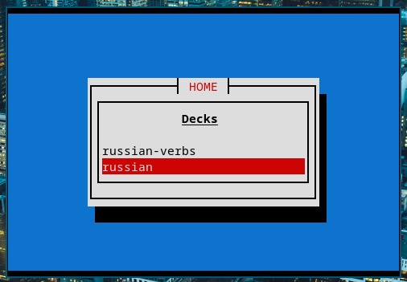
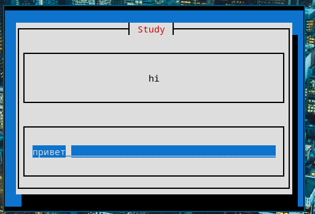
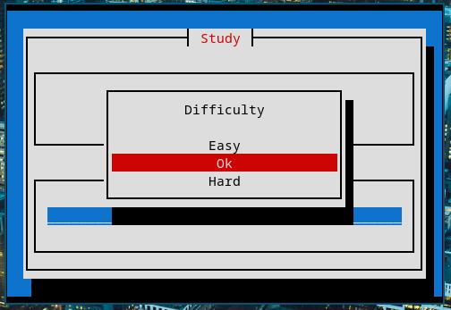

# Project-A

> Not ready for use: Currently still in development!
# Purpose
A lightweight flashcard program that utilizes spaced time repetition and focuses heavily on spelling/writing.

# Example
## Home Window 

## Study Window

## Difficulty

# Keybinds
## Homepage
- `q`   Quit
- `Esc` Normal Mode
- `:`   Command Mode
- `?`   Show All Commands And Keybindings
- 'A'   Add Deck
- 'a'   Add Card
- 'd'   Delete Deck
- `r/i` Rename Deck
- `j/k` Down/Up
- `e`   Edit Deck's Cards with and editor
- `s`   Show Deck Stats
## Study page
- `q`    Quit
- `Esc  `Normal Mode
- `i`    Insert Mode
- `?`    Show All Commands And Keybindings
- `e`    Edit Card
- `h`    Hint
- `H`    Homepage
- 'Enter'
# Config
max_hints         = 0
> 0 = off, -1 = unlimited
tui_mode          = classic
> Classic curses look
selected_color = "blue"
card_front     = "white"
no_punctuation = true

# TODO 
- [] Set new and review card daily limit (set_study_cards)
- [] Let the user add cards via the TUI
- [] Allow color modifications
- [] Allow the user to decide whether or not to keep punctuation
- [] Allow the user to decide how loose spelling can be
    - 1 char off should be default
    - 0 = off
- [] Create a help screen that displays commands and keybindings
- [] Allow command mode
- [] Rename deck (Inline with homepage if possible)
- [] Add deck (Inline with homepage if possible)
- [] Remove Deck
- [] Add Card (Homepage)
- [] Remove Card (Study Page)
- [] Edit Card (Study Page)
- [] Edit Cards (Vim HomePage)
- [] Try to make use of ReviewSystem more
- [] Import anki deck
- [] Practice only hard cards
- [] Import/Export Json
- [] Turn loose functions into impls
- [x] Implement Difficulty enum
- [x] When no cards left in deck after session, take user back to homepage
- [x] Separate tui.rs code out:
    - Homepage
    - Study Page
    - Add Card
- [] Implement notify-rs (filewatcher)?
    - Might reduce code
